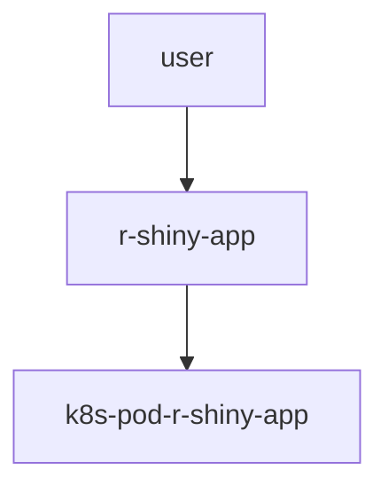

# R Shiny App on AKS 


<details>
  <summary>Click to see the - diagram</summary>
    
    


you can deploy 1 per user for demo etc.. reduce complexity 

</details>
    
## Demo 


<details>
  <summary>Click to see the - build</summary>
    
### build component


```
export registry_name='tevaprivatedemo.azurecr.io'
echo ${registry_name}
```


```
docker build -t ${registry_name}/r-shiny-app:1 .
docker push ${registry_name}/r-shiny-app:1
```

</details>

<details>
  <summary>Click to see the - install on AKS  </summary>
  
### install on AKS  

```
helm upgrade -i lola-r-shiny-app1 --create-namespace -n r-shiny-app  r-shiny-app 
```

validate 

```
kubectl get ingress -n r-shiny-proxy 
```

```
kubectl get pods  -n r-shiny-proxy 
```


start to the url and start enjoy :) 
</details>


</details>

<details>
  <summary>Click to see the - puting all togahter </summary>
  
### puting all togahter L:)

```
export registry_name='tevaprivatedemo.azurecr.io'
echo ${registry_name}
docker build -t ${registry_name}/r-shiny-app:1 .
docker push ${registry_name}/r-shiny-app:1

helm upgrade -i lola-r-shiny-app1 --create-namespace -n r-shiny-app  r-shiny-app 

kubectl get pods  -n r-shiny-app

kubectl get ingress -n r-shiny-app

kubectl get pods  -n r-shiny-app  -w 

```
</details>
